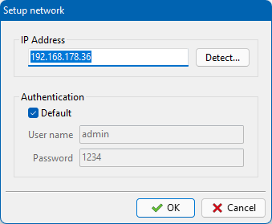

# Edimax

__Edimax SP-2101W__ is a smart plug to turn an electrical device connected to it on and off under wifi control, 
and to measure its power consumption where data values are transmitted by wifi. 
The plug can be controlled in a limited way by means of smartphone apps (__EdiSmart__, __EdiSmart__). 
Greater applicability, however, can be obtained by means of a self-made and taylored PC application.

The application __edimax__ has the following features:

* measure the power consumption of electrical devices as a function of time
* display and plot the measured data as power (W), current (A) or energy (Wh). The energy consumption over time is calculated by integration of the measured power curve.
* store the measured data in a csv file
* load previously measured curves and overlay them for comparison in a plot

## Hardware setup

* Install the app _Ediplug_ on your smartphone. I bought my Edimax plug back in 2016; wanting to reinstall this app now again in 2022, I noticed that it is no longer distributed by the Google PlayStore, and I had to use it from a third-party site. (Officially there are the _EdiSmart_ or _EdiLife_ apps now, but I don't know whether they work with my old Edimax plug.)
* Connect the Edimax plug to power and wait until it is ready; this is indicated by the slowly flashing green bottom LED (slow flashing means: "waiting for 
configuration".
* Connect your smartphone to the wifi net provided by the plug. It has the SSID "Ediplug.setup". No password required.
* Run the _Ediplug_ app on the smartphone. Select "+" to add a new plug. It will display a list of the wifi networks found. Select your normal wifi net from the list. Enter your wifi password. 
* Close the app. Now the plug shuts down its own wifi net and is connected to your normal wifi net. The initially flashing LED is lighting constantly now. 
* You still can use the _Ediplug_ smartphone app for remote switching of electrical devices connected to the plug, or for measurement of the power consumed by them. Or on a PC, you can use the _edimax_ application presented here.

## Compilation of the edimax application

* This application is distributed as Pascal source code only. Use Lazarus v2.0+ and the Free Pascal Compiler (FPC) v3.0+ to create a binary. The source does not depend on external third-party packages (well, it does depend on the external _synapse_ and _industrial_ packages but the files needed are contained in the repository; there is nothing to be installed).
* The application definitely works on Windows, macOS (10.14) and Linux/gtk2. Other widgetsets may work as well, but were not tested at the time of this writing.

## Setup of the edimax application

* When _edimax_ starts for the first time, its _Setup network_ dialog opens in which you must specifiy the IP address of the Edimax plug. Click on "Detect" to send a broadcast in order to find out its IP address. 

* If you changed the default username and password of the plug you must also enter these data in the _Setup network_ dialog. (BTW, the factory-set default username and password are "admin" and "1234", respectively).

## Power consumption of an electrical device: measurement of a time series

* Connect the device to be tested to the Edimax plug.
* In the _edi_ application click on the "Start" button. 
* The power consumption is measured about every second and transmitted to the PC via wifi where the values are listed in a table and a chart.
* Click on the "W", "A" or "Wh" button to switch the chart to the display of power, current or energy, respectively. Note that the energy values are not measured by the plug but are calculated from the application by numerical integration of the power values over time.
* Clock on the "Stop" button to end the measurement.
* Use the "Save" button to save the aquired data to a csv text file.
* Use the "Load" button to load previously measured data files and overlay them in the chart.
